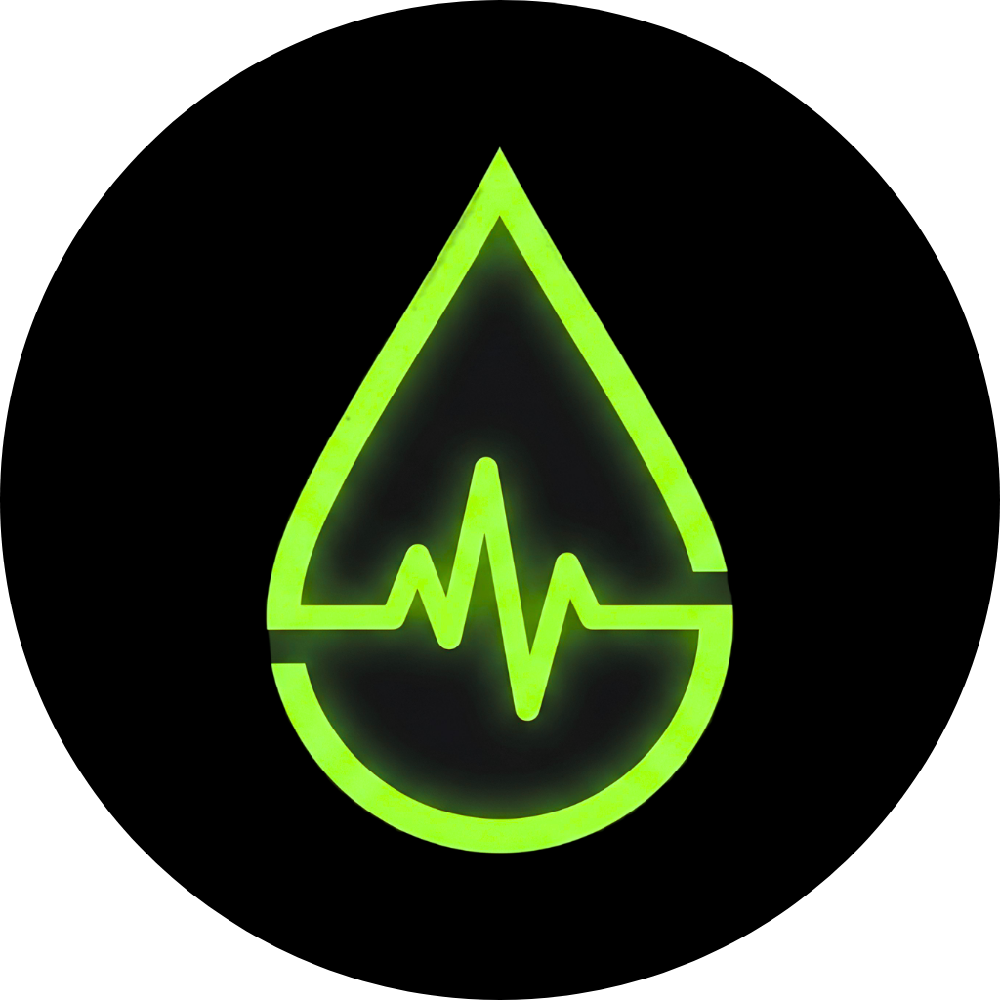

<div align="center">
  
  
  # 🩸 Qatra (قطرة)
  ### Qatra: Tech-Driven Wellness for Every Moroccan. 🕊️🇲🇦
  
  [](https://opensource.org/licenses/MIT)
  [](#)
  [](https://firebase.google.com/)
  
  **"Saving lives, one drop at a time."**
</div>

---

## 🌟 Overview

**Qatra** is a comprehensive, real-time platform designed to revolutionize blood donation management in Morocco. By bridging the gap between donors and medical facilities, Qatra ensures that every emergency finds its hero in minutes, not hours.

With its sleek **Dark Mode** interface and high-performance architecture, Qatra provides a seamless experience for both altruistic donors and clinic administrators.

---

## 🚀 Key Features

### 🏢 For Clinics (Qatra Pro)
- **Live SOS Radar**: Broadcast urgent blood requests to donors within a 10km radius in real-time.
- **AI Stock Forecasting**: Predictive analytics to anticipate blood shortages before they happen.
- **Smart Inventory**: Digital management of blood bags with QR-code verification.
- **Hospital Network**: A secure communication hub for inter-hospital coordination and resource sharing.

### 👤 For Donors (Qatra App)
- **Golden Donor Ranking**: Gamified experience where donors earn points, badges, and ranks (Bronze to Diamond).
- **Lives Saved Counter**: Visual impact tracking of how many lives each donor has helped save.
- **Emergency Notifications**: Instant alerts when a nearby clinic needs your specific blood type.
- **Digital Passport**: Quick check-in at clinics using personal QR codes.

---

## 🛠️ Tech Stack

- **Core**: HTML5, Vanilla JavaScript, CSS3 (Custom Design System).
- **Backend/Real-time**: Firebase (Realtime Database, Firestore, Auth, Hosting).
- **Mobile**: Android (Kotlin, Jetpack Compose).
- **Visualization**: Chart.js (Impact & Stock Reports), Leaflet.js (Interactive Radar Maps).
- **Design**: Modern Dark-Mode, Glassmorphism, HSL-tailored color palettes.

---

## 📂 Project Structure

```bash
├── 📱 app/                 # Android Mobile Application (Kotlin)
├── 🏢 clinic.html          # Professional Clinic Dashboard
├── 🌐 index.html           # Main Landing Page & Donor Portal
├── 🎨 clinic_style.css     # Premium UI System (Glassmorphism)
├── ⚙️ clinic_main.js       # Real-time Firebase & Map Logic
└── 📜 database.rules.json  # Secure Role-Based Access Control (RBAC)
```

---

## 💻 Getting Started

### Prerequisites
- Node.js & npm (for hosting/dev)
- Android Studio (for mobile development)

### Local Development
1. **Clone the repository**:
   ```bash
   git clone https://github.com/your-username/qatra.git
   ```
2. **Setup Environment**:
   Create a `.env` file with your Firebase configuration.
3. **Run Web App**:
   ```bash
   npm install
   npm run dev
   ```
4. **Deploy to Firebase**:
   ```bash
   firebase deploy
   ```

---

## 🔒 Security & Privacy

Qatra is built with a **Security-First** approach:
- **No-Index Privacy**: Clinical dashboards are hidden from search engines (Google, Bing).
- **Encrypted Data**: End-to-end encryption for sensitive medical information.
- **RBAC**: Strict role-based access control to ensure only authorized personnel access hospital data.

---

## 🌐 Connect With Us

Stay updated with the latest news and donor success stories:

- **Facebook**: [Qatra Official](https://web.facebook.com/profile.php?id=61589092855136)
- **Instagram**: [@qatra_ma](https://www.instagram.com/qatra_ma)
- **Official Website**: [qatra.web.app](https://qatra.web.app)

---

## 🤝 Contributors

- **Anouar** - Lead Developer & UI/UX Designer

---

<div align="center">
<p>Founded, Developed & Designed with ❤️ in Morocco by Anouar Boudehbi</p>
</div>

 
 
