

  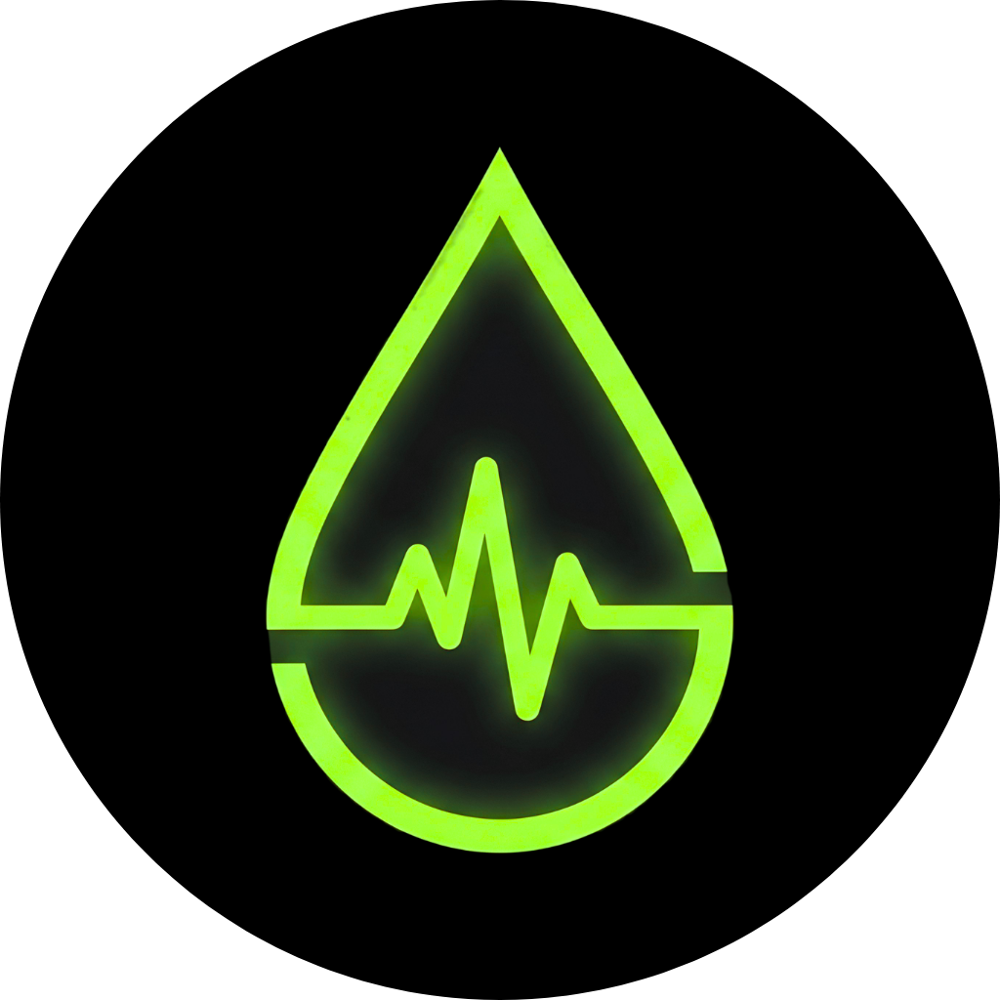
  
  # 🩸 Qatra (قطرة)
  ### The Ultimate Health-Tech & Social Solidarity Super App for Morocco. 🕊️🇲🇦
  
  
  
  
  
  
  
  **"Connecting hearts, mobilizing care, and saving lives in real-time."**

---

## 🌟 Overview

**Qatra** is a state-of-the-art, multi-faceted Health-Tech and Civic Solidarity Super App engineered to revolutionize blood donation logistics and decentralized home healthcare across the Kingdom of Morocco. Built from the ground up to solve critical medical time-to-response challenges, Qatra establishes a direct, high-trust digital bridge connecting voluntary blood donors, patients, certified healthcare professionals, pharmacies, and regional transfusion centers.

By coupling a futuristic, ultra-fast web command interface with a modern Kotlin-powered native mobile application, Qatra guarantees that critical emergency blood requests mobilize matching donors within minutes, while empowering patients with certified home nursing, physical therapy, and verified emergency supplies.

---

## 💎 Core Architecture & Technical Highlights

### 1. 🩸 National Blood Donation Command Center
* **Spatial Geofenced Dispatch**: High-efficiency Haversine spatial algorithms calculate geographical proximity in milliseconds to broadcast urgent alerts to compatible donors within a localized radius, eliminating notification fatigue.
* **Live Regional Stock Barometer**: Dynamic tracking of blood reserves across all major administrative health regions of Morocco (Casablanca-Settat, Rabat-Salé-Kénitra, Marrakech-Safi, Tanger-Tétouan-Al Hoceïma, Fès-Meknès, Souss-Massa).
* **Anti-Fraud Medical Verification**: Integrated validation protocol for official hospital blood requests (*Demande de sang officielle*), granting verified emergency calls a green cryptographic trust badge to maximize donor mobilization.
* **Gamified Civic Loyalty & Digital Passport**: Tiered recognition ranks (*منقذ النخبة*, *درع الوطن*, *سفير الحياة*) and tamper-resistant digital donor profiles that track cumulative lives saved.

### 2. 🩺 Decentralized Home Healthcare Concierge
* **On-Demand Licensed Care**: Real-time dispatching of certified nurses for professional dressing and wound care, and licensed physiotherapists for rehabilitation.
* **Provider Geospatial Radar**: Interactive spatial radar interface allowing licensed practitioners to visualize nearby service requests in real time.
* **Autonomous Wallet Ledger**: Direct digital accounting ledger for medical practitioners with transparent transaction histories and automated balance calculations.

### 3. 🏪 Strategic Pharmacy Solidarity Network
* **Live Catalog & Reserve Verification**: Digital synchronization with partner pharmacies and parapharmacies across major metropolitan hubs for real-time inventory checking.
* **P2P Medicine Redistribution (*صيدلية التضامن*)**: Secure citizen-to-citizen solidarity channel facilitating the donation of surplus, non-expired medications to low-income families under strict safety guidelines.

### 4. 🤖 Anwar AI Empathy & Health Guidance Engine
* **Tri-Lingual Health Intelligence**: Powered by generative AI, Anwar communicates fluently in **Moroccan Darija (الدارجة المغربية)**, **French**, and **English**.
* **Clinical Knowledge & Psychological Support**: Provides guidance on blood donation preparation, addresses needle apprehension with evidence-based relaxation strategies, and clarifies first-aid procedures.

### 5. 🚨 Seismic Early-Warning & Citizen Safety Mesh
* **Crowdsourced Telemetry**: Transforms connected smartphones into a distributed network capable of logging initial seismic vibrations to warn surrounding communities.
* **Multi-Channel Emergency Broadcast**: Automatic fallback from cloud synchronization to instant SMS and WhatsApp dispatching, ensuring mission-critical alerts function during network congestion.

---

## 📱 App Showcase

  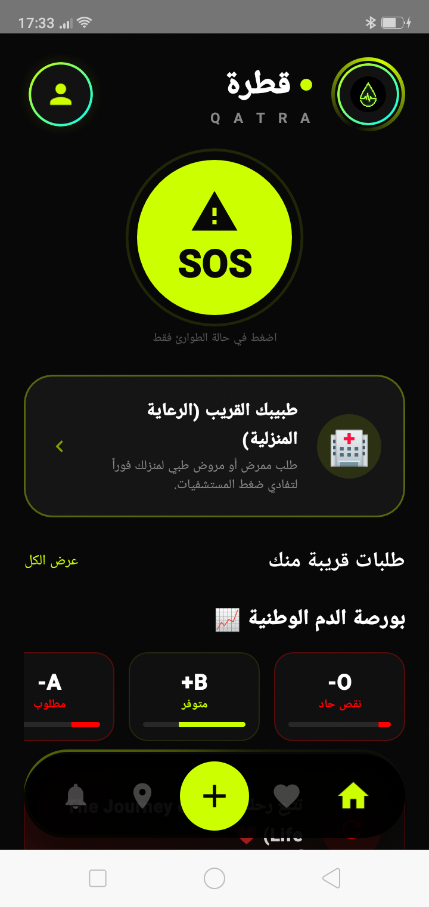
  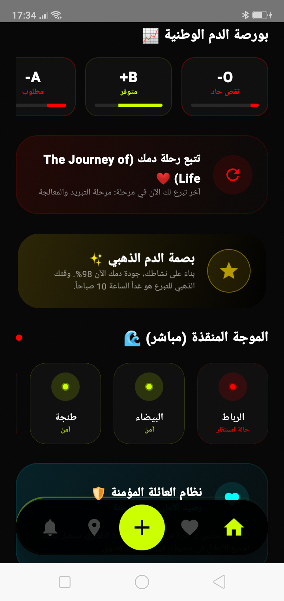
  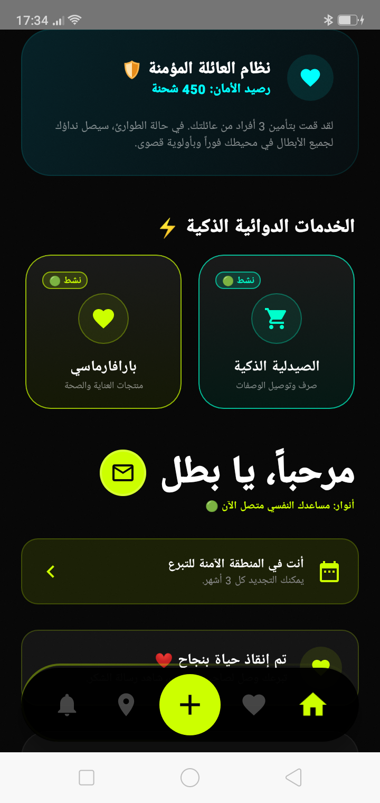
  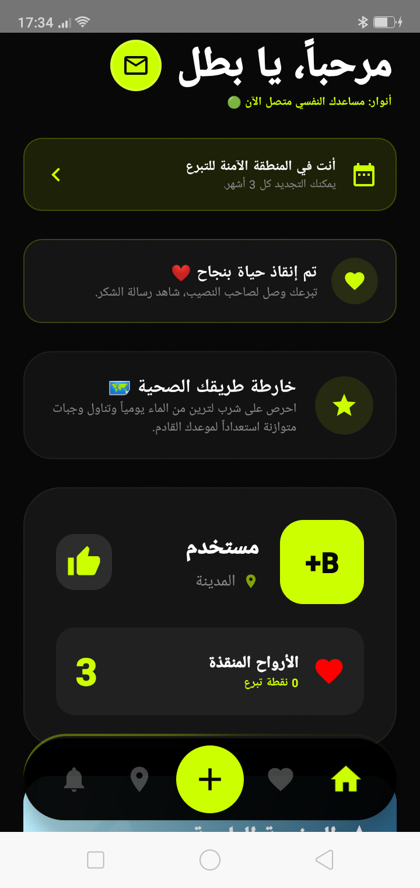
  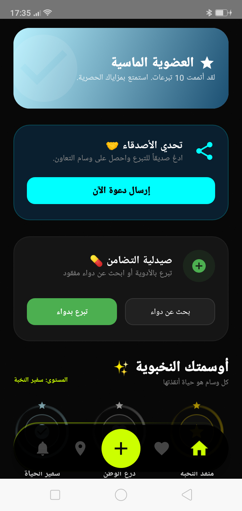
  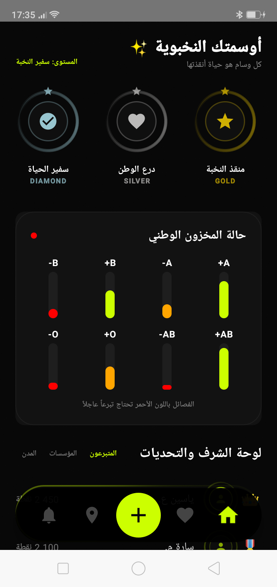
  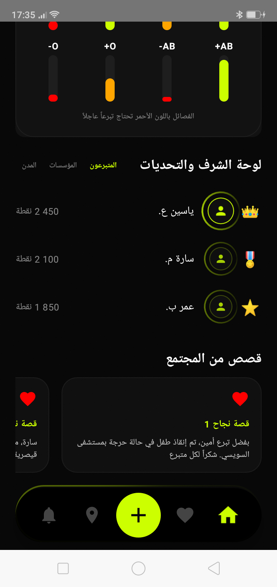
   
  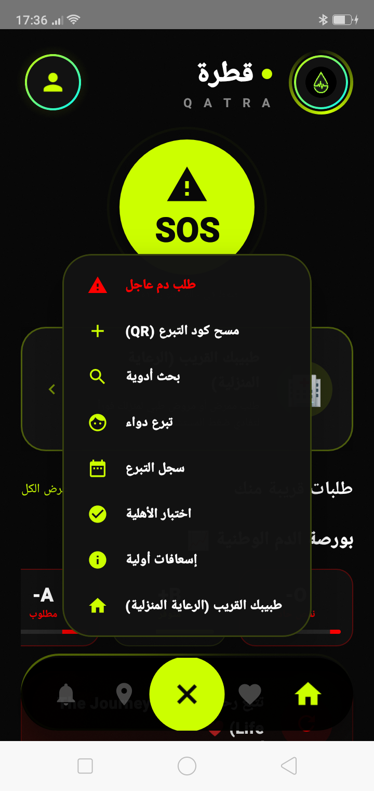
  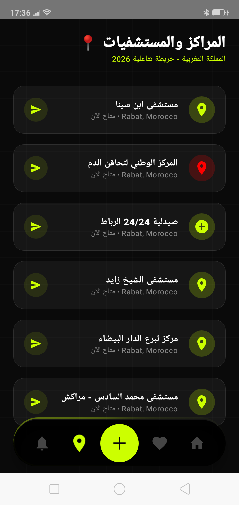
  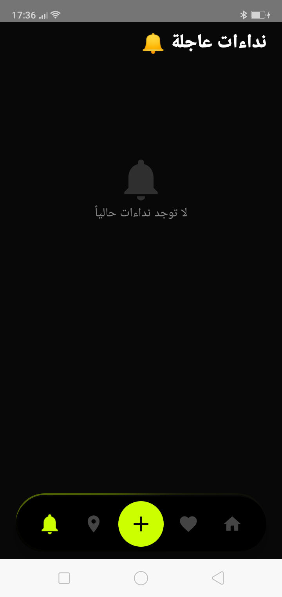
  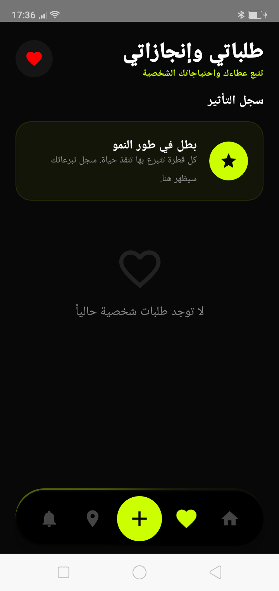
  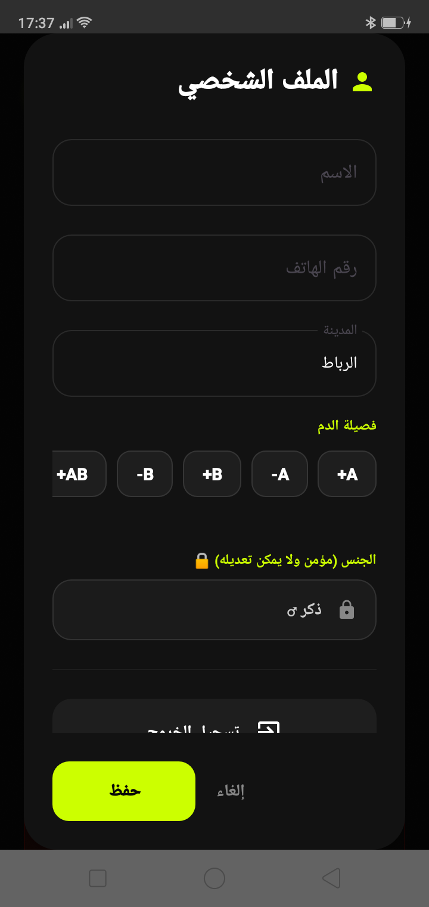
  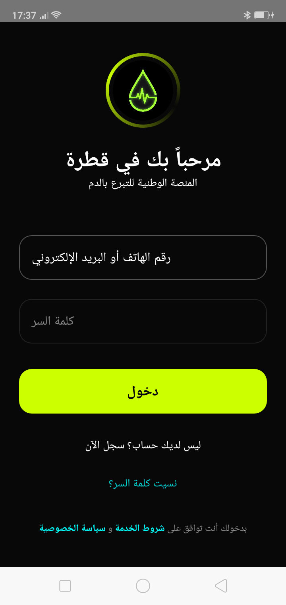
  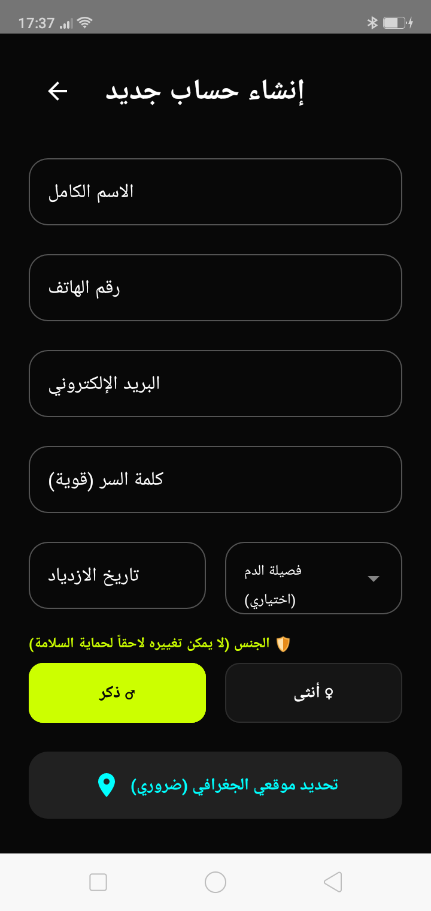

---

## 🛠️ Technology Stack & Engineering Standards

* **Native Mobile Architecture**: Kotlin, Jetpack Compose, Coroutines & Kotlin Flow, Location Services, Hardware Haptics.
* **Web Engineering**: Semantic HTML5, Vanilla CSS3 (Custom Glassmorphism design tokens, CSS variables, Dark Mode aesthetics), Leaflet GIS mapping engine, Modular JavaScript.
* **Cloud & Infrastructure**: Distributed Realtime Sync, Secure Tokenized Authentication, Distributed Cloud Storage, CDN edge delivery.
* **Resilience & Fallback Engineering**: Offline PWA caching, local storage state persistence, carrier SMS fallback bridges.

---

## 🔒 Security, Trust & Data Protection

Qatra is architected with a strict **Security-First** and **Privacy-by-Design** philosophy:
* **Zero-Trust Role-Based Access Control (RBAC)**: Fine-grained declarative security policies ensure that patients, healthcare providers, and administrative personnel can only access authorized data pathways.
* **No-Index Privacy Protection**: Administrative consoles and medical dashboards strictly enforce `X-Robots-Tag: noindex, nofollow` headers to eliminate any public indexing of sensitive patient records.
* **Resilient Deserialization**: Strict type casting and null-safe data models safeguard mobile clients against inconsistent payloads.
* **Data Minimization**: Emergency broadcasts convey only medically essential parameters (blood group, city, hospital) to protect donor and patient identities.

---

## 🤝 Ecosystem Synergy

* **Moroccan Pharmacy Landscape**: Direct synchronization for real-time item availability and healthcare accessibility.
* **DABA Logistics Network**: Strategic ecosystem interoperability enabling synchronous delivery coordination between healthcare practitioners and logistics ambassadors.

---

## 🌐 Connect & Community

* **Official Portal**: [qatra.web.app](https://qatra.web.app)
* **LinkedIn**: [Anouar BOUDEHBI](https://www.linkedin.com/in/boudehbi-anouar)
* **Wikipédia**: [Anouar Boudehbi - Wikipédia](https://fr.wikipedia.org/wiki/Utilisateur:Anouar_Boudehbi)
* **Facebook**: [Qatra App Official](https://web.facebook.com/profile.php?id=61589092855136)
* **Instagram**: [@qatra_app](https://www.instagram.com/qatra_app)

---

## 👨‍💻 Author & Lead Architect

<table>
  <tr>
    <td align="center">
      <a href="https://www.linkedin.com/in/boudehbi-anouar">
         
        <b>Anouar BOUDEHBI</b>
      </a> 
      Founder & CEO | Lead System Architect & UI/UX Designer  
      
      
      
    </td>
  </tr>
</table>

---

  
<b>Qatra: Tech-Driven Wellness for Every Moroccan. 🕊️🇲🇦</b>

